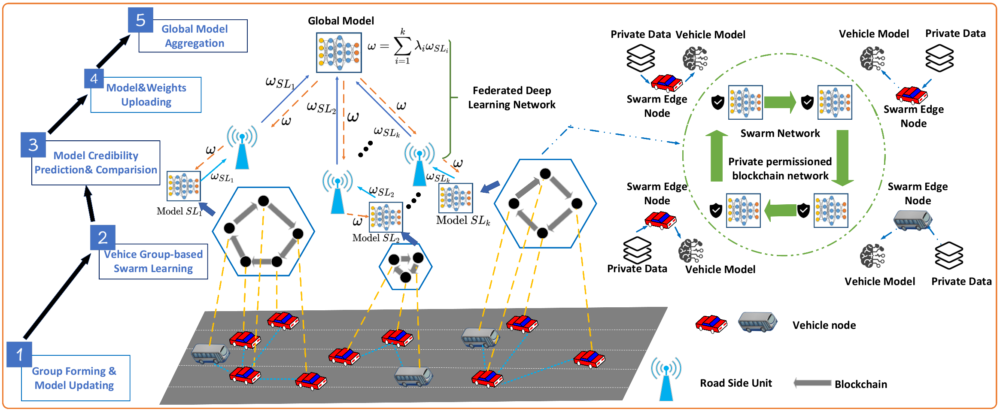

# IoV-SFDL: Swarm-Federated-Deep-Learning Framework
LSTM network to verify trajector prediction on the NGSIM dataset based on IoV-SFDL framework.

Paper Link:   https://arxiv.org/abs/2108.03981

## Framework Scheme


<div>			<!--块级封装-->
    <center>	<!--将图片和文字居中-->
    
    <br>		<!--换行-->
  IoV SFDL Framework.	<!--标题-->
    </center>
</div>

## Getting Started

* **[Prerequisites](https://github.com/HewlettPackard/swarm-learning/blob/v0.3.0/docs/Prerequisites.md) for Swarm Learning**

The SFDL is based on the Swarm Learning framework. The specific prerequisites is the same as Swarm Learning framework, which could be shown as above.

* **Clone this repository**

```shell
git clone https://github.com/CoderTylor/IoV-SFDL-Swarm-Federated-Deep-Learning.git
```

* **[Download and setup](https://github.com/HewlettPackard/swarm-learning/blob/v0.3.0/docs/setup.md) docker images and evaluation licenses**

As the same as the Swarm Learning framework have a maximum of 16 sn nodes and other identity authentication nodes.

* **Execute Steps**

**1. Start the License Server**

Do not stop the License Server once the licenses are installed

```shell
cd ~/Swarmlearning/bin

Start the APLS container using swarm-learning-install-dir/swarm-learning/bin/run-apls --apls-port=5814
sudo chmod +x swarm-learning-install-dir/swarm-learning/bin/run-apls
cd ./swarm-learning-install-dir/swarm-learning/bin/
./run-apls

open chrom with url 127.0.0.1:5814
default username:admin, password:password
Install Liscense
Notice: The Swarm Learning Framework Liscense has a maximam of 16 sn nodes and 4 other nodes.
```

<div>			<!--块级封装-->
    <center>	<!--将图片和文字居中-->
    
    <br>		<!--换行-->
  Install Swarm Learning Liscense.	<!--标题-->
    </center>
</div>


**2. Init Circle-1 workspace**

```shell
cd .~/S/mnist-keras/bin
APLS_IP=<License Host Server IP>
EXAMPLE=mnist-keras
WORKSPACE_DIR=$PWD
./mnist-keras/bin/init-workspace -e $EXAMPLE -i $APLS_IP -d $WORKSPACE_DIR
```

**3. Init Circle-2 workspace**

```shell
cd .~/mnist-pytorch/bin
EXAMPLE=mnist-pytorch
WORKSPACE_DIR=$PWD
./mnist-pytorch/bin/init-workspace_2 -e $EXAMPLE -i $APLS_IP -d $WORKSPACE_DIR
```

<font color=red>Tips: </font> 

<font color=red>1. The self-designed deep learning program is placed in the mini-PyTorch and mini-Keras folders to replace the original deep learning program. This way can solve the problem of the program error.</font> 

<font color=red>2. Use docker network ls to check whether the two different docker images have connected to the same docker netork, as the Pic shown bellow</font> 

**4. Execute Circle-1**

```shell
#！/user/bin/env bash


bash main.sh

or Run it Step by Step

APLS_IP=<License Host Server IP>
EXAMPLE=mnist-keras
WORKSPACE_DIR=$PWD

TRAINING_NODE=node1
../swarm-learning/bin/run-sl --name $TRAINING_NODE-sl --network $EXAMPLE-net --host-ip $TRAINING_NODE-sl --sn-ip node-sn -e MAX_EPOCHS=5 --apls-ip $APLS_IP --serverAddress node-spire -genJoinToken --data-dir $WORKSPACE_DIR/ws-$EXAMPLE/$TRAINING_NODE/app-data --model-dir $WORKSPACE_DIR/ws-$EXAMPLE/$TRAINING_NODE/model --model-program mnist_tf.py --sl-platform TF

TRAINING_NODE=node2
../swarm-learning/bin/run-sl --name $TRAINING_NODE-sl --network $EXAMPLE-net --host-ip $TRAINING_NODE-sl --sn-ip node-sn -e MAX_EPOCHS=5 --apls-ip $APLS_IP --serverAddress node-spire -genJoinToken --data-dir $WORKSPACE_DIR/ws-$EXAMPLE/$TRAINING_NODE/app-data --model-dir $WORKSPACE_DIR/ws-$EXAMPLE/$TRAINING_NODE/model --model-program mnist_tf.py --sl-platform TF

TRAINING_NODE=node3
../swarm-learning/bin/run-sl --name $TRAINING_NODE-sl --network $EXAMPLE-net --host-ip $TRAINING_NODE-sl --sn-ip node-sn -e MAX_EPOCHS=5 --apls-ip $APLS_IP --serverAddress node-spire -genJoinToken --data-dir $WORKSPACE_DIR/ws-$EXAMPLE/$TRAINING_NODE/app-data --model-dir $WORKSPACE_DIR/ws-$EXAMPLE/$TRAINING_NODE/model --model-program mnist_tf.py --sl-platform TF

...
```

**5. Execute Circle-2**

```shell
#！/user/bin/env bash
APLS_IP=<License Host Server IP>
EXAMPLE=mnist-keras
WORKSPACE_DIR=$PWD

TRAINING_NODE=node1
../swarm-learning/bin/run-sl --name $TRAINING_NODE-sl --network $EXAMPLE-net --host-ip $TRAINING_NODE-sl --sn-ip node-sn -e MAX_EPOCHS=5 --apls-ip $APLS_IP --serverAddress node-spire -genJoinToken --data-dir $WORKSPACE_DIR/ws-$EXAMPLE/$TRAINING_NODE/app-data --model-dir $WORKSPACE_DIR/ws-$EXAMPLE/$TRAINING_NODE/model --model-program mnist_pyt.py --sl-platform TF

TRAINING_NODE=node2
../swarm-learning/bin/run-sl --name $TRAINING_NODE-sl --network $EXAMPLE-net --host-ip $TRAINING_NODE-sl --sn-ip node-sn -e MAX_EPOCHS=5 --apls-ip $APLS_IP --serverAddress node-spire -genJoinToken --data-dir $WORKSPACE_DIR/ws-$EXAMPLE/$TRAINING_NODE/app-data --model-dir $WORKSPACE_DIR/ws-$EXAMPLE/$TRAINING_NODE/model --model-program mnist_pyt.py --sl-platform TF
	
TRAINING_NODE=node3
../swarm-learning/bin/run-sl --name $TRAINING_NODE-sl --network $EXAMPLE-net --host-ip $TRAINING_NODE-sl --sn-ip node-sn -e MAX_EPOCHS=5 --apls-ip $APLS_IP --serverAddress node-spire -genJoinToken --data-dir $WORKSPACE_DIR/ws-$EXAMPLE/$TRAINING_NODE/app-data --model-dir $WORKSPACE_DIR/ws-$EXAMPLE/$TRAINING_NODE/model --model-program mnist_pyt.py --sl-platform TF

...
```

**6. Execute global federated Learning**

```shell
cd root
python federated.py
```


## References

- [Papers](https://arxiv.org/pdf/2108.03981.pdf)
- [Videos]()


